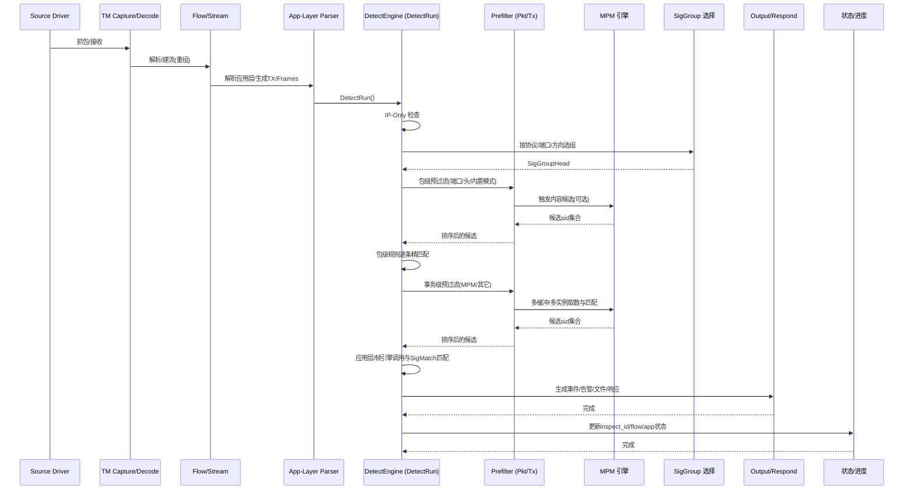

## 规则引擎与检测引擎架构与流程

### 概览
- **定位**: Suricata 的规则与检测引擎负责将规则从文本解析为高效的运行时结构，并在包/事务/帧多个层面进行高性能匹配与裁剪。
- **关键对象**: `Signature`（规则）、`SigMatch`（关键字实例）、`SigTableElmt`（关键字元信息）、`DetectEngineCtx/DetectEngineThreadCtx`（引擎上下文）、`SigGroupHead`（规则分组头）。
- **检查面**: 包级（packet）、应用层事务（tx）、帧（frames），基于 Buffer/列表模型，支持 MPM、变换与多实例。

### 运行流程图（Runtime Flow）
```mermaid
flowchart TD
    A[数据包/帧到达\nAF_PACKET/AF_XDP/DPDK/PCAP/NFLOG/NFQ/NETMAP/WinDivert] --> B[TM流水线: capture]
    B --> C[decode 解码 L2/L3/L4]
    C --> D[flow 流表/会话]
    D --> E{TCP?}
    E -- 是 --> F[stream 重组]
    E -- 否 --> G[继续]
    F --> G[继续]
    G --> H[app-layer parser\n事务/帧解析]
    H --> I[DetectRun 入口]
    I --> J[IP-Only 引擎]
    J --> K[选择 SigGroupHead\n(协议/端口/方向)]
    K --> L[包级预过滤 PrefilterPkt\n(端口/头字段/内置MPM)]
    L --> M[包级规则检查]
    M --> N{已决策 drop/accept?}
    N -- 是 --> Z[输出/记录\nEVE/日志/文件/响应] --> AA[状态更新/清理] --> AB[结束]
    N -- 否 --> O[事务级预过滤 PrefilterTx\nMPM/其它引擎]
    O --> P[应用层/帧检查\nInspect Engines]
    P --> Q[逐条 SigMatch 精确匹配\n(content/pcre/keywords)]
    Q --> R[后置预过滤(依赖匹配)\n如 flowbits 派生候选]
    R --> S[输出/记录\nEVE/日志/文件/响应]
    S --> T[事务进度与状态更新\ninspect_id/flow/app]
    T --> AA[状态更新/清理] --> AB[结束]
```

### 时序图（Per-packet/tx Sequence）


### 函数流程图（Function Flow）

- DetectRun 主路径（`src/detect.c::DetectRun`）
```mermaid
flowchart TD
    A[DetectRun(tv,de_ctx,det_ctx,p)] --> B[取 flow]
    B --> C[DetectRunInspectIPOnly]
    C --> D[DetectRunGetRuleGroup]
    D --> E{有 SigGroupHead?}
    E -- 否 --> Z[DetectRunPostRules + Cleanup] --> AA[返回]
    E -- 是 --> F[DetectRunPrefilterPkt]
    F --> G[DetectRulePacketRules]
    G --> H{包级决策(drop/accept)?}
    H -- 是 --> Z[DetectRunPostRules + Cleanup] --> AA[返回]
    H -- 否 --> I{有AL状态/允许检查?}
    I -- 否 --> Z
    I -- 是 --> J[DetectRunFrames (可选)]
    J --> K[DetectRunTx (事务级匹配)]
    K --> L[AppLayerParserSetTransactionInspectId]
    L --> Z[DetectRunPostRules + Cleanup] --> AA[返回]
```

- 规则加载/编译管线（`detect-engine-loader.c` → `detect-parse.c` → `detect-engine-build.c`）
```mermaid
flowchart TD
    A[加载规则文件行] --> B[DetectEngineAppendSig]
    B --> C[SigInit + SigParseBasics\n(action/proto/addr/port)]
    C --> D[SigParseOptions\n循环解析keyword]
    D --> E[SigTableGet(opt)->Setup\n构建SigMatch链]
    E --> F[SigMatchList2DataArray\n(sm_arrays)]
    F --> G[DetectEngineBuild 阶段]
    G --> H[分组: detect-engine-siggroup\n(SigGroupHead)]
    H --> I[Fast Pattern/MPM提取\n detect-fast-pattern]
    I --> J[注册MPM与预过滤\n detect-engine-mpm/prefilter]
    J --> K[准备缓冲/多实例/变换\n buffer types]
    K --> L[引擎就绪(可运行)]
```

### 核心数据结构要点
- **Signature**: 完整规则容器，含动作、协议、端口/地址、`sm_arrays`、`app_inspect/pkt_inspect/frame_inspect` 与 `init_data`。
- **SigMatch**: 单个关键字实例（链表），在解析阶段挂到不同 `DETECT_SM_LIST_*` 列表。
- **SigTableElmt**: 关键字注册元信息，含 `Setup/Match/AppLayerTxMatch/SupportsPrefilter/SetupPrefilter/Transform` 等回调。
- **DetectEngineCtx/ThreadCtx**: 引擎全局/线程上下文，线程侧持有 PM 阶段候选队列、缓冲与性能计量等。
- **SigGroupHead**: 规则分组（按协议/端口/属性），承载预过滤引擎与 MPM 上下文。

### 关键源码路径
- **引擎运行**: `src/detect.c`、`src/detect-engine.c`
- **解析与注册**: `src/detect-parse.c`、`src/detect-engine-register.h`、关键字实现如 `src/detect-content.c`
- **构建阶段**: `src/detect-engine-build.c`（分组/属性修饰）、`src/detect-engine-siggroup.c`
- **MPM 与 Fast Pattern**: `src/detect-engine-mpm.c`、`src/detect-fast-pattern.c`
- **预过滤**: `src/detect-engine-prefilter.c`
- **Buffer/列表**: `src/detect-engine.h`（Buffer Type 注册/能力）
- **应用层/帧检查**: `src/detect-engine.c` Inspect Engine 注册与调度

### 扩展指引（新增关键字）
1) 在 `src/detect-*.c` 定义注册函数：设置 `sigmatch_table[id].name/Setup/Match/.../flags`。
2) 在 `src/detect-engine-register.h` 的 `enum DetectKeywordId` 追加枚举项。
3) 在 `SigTableSetup()` 调用你的 `Register()` 完成注册。
4) 需要 MPM 或 sticky buffer 时：使用 `DetectAppLayerMpmRegister*` 并通过 Buffer Type 注册开启 `SupportsMpm/SupportsTransformations/SupportsMultiInstance` 等能力。
5) 需要 Tx/帧检查时：注册相应 Inspect Engine。

### 参考
- 主要文件：`src/detect.c`、`src/detect-engine.c`、`src/detect-engine-build.c`、`src/detect-engine-siggroup.c`、`src/detect-engine-mpm.c`、`src/detect-engine-prefilter.c`、`src/detect-parse.c`、`src/detect-content.c`。